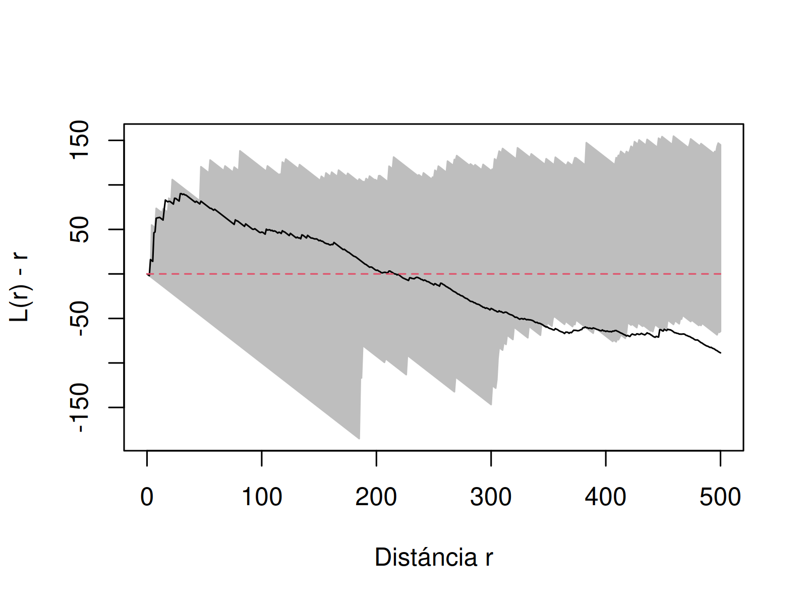

# Caracterización de los siniestros viales ocurridos en Posadas (2022-2023)

Repositorio creado para gestionar los análisis de caracterización de los siniestros viales ocurridos en Posadas.

# Al respecto de los datos
Los datos fueron generados por un proceso de Geocoding o Georreferenciación manual a partir de notícias publicadas en el diário Primera Edición, [trabajo desarrollado por Claudia Vargas](https://tusigyt.github.io/lit/proyectos/), como Proyecto de Intervención de la Tecnicatura Universitária en Sistemas de Información Geográfica y Teledetección (TUSIGyT) de la Facultad de Ciencias Forestales (FCF) de la Universidad Nacional de Misiones (UNaM).

Más allá de la ubicación geográfica, el conjunto de datos dispone de una table de atributos con la siguientes informaciones:  
- Fecha de publicación: Fecha de la publicación de la notícia de siniestro vial;
- Lugar: Texto de la ciudad;
- Ubicación: Texto de la ubicación; 
- Vehiculos: Tipo de vehiculo(s) involucrado(s);
- Decesos: Valor numerico de la cantidad de fallecidos reportados en la noticia
- Lesionados: Valor numerico de la cantidad de lesionados reportados en la notícia;
- Incertidumbre: Nível de incertidumbre de la georreferenciación ("Baja", "Media", "Alta");
- Herramienta: Herramienta usada para la georeferenciación ("Geocoding" o "Manual")
- URL de la noticia;

## Otros datos usados  

- [IDE Posadas](https://www.ide.posadas.gob.ar/):  
  - [Semaforos](https://www.ide.posadas.gob.ar/layers/ideposadas_data:geonode:Semaforos)  
  - [Red vial](https://www.ide.posadas.gob.ar/layers/ideposadas_data:geonode:red_vial_0305)  
- [IDE Misiones](https://ide.ordenamientoterritorial.misiones.gob.ar/):  
  - Límite Municipal 2023;  

# Objetivos
Realizar un análisis exploratório usando técnicas y estadísticas espaciales/geográficas para caracterizar los siniestro viales ocurridos en Posadas en 2022 y 2023;

## Algunas preguntas disparadoras y posibles análisis a usar:
- Los siniestros viales ocurridos en 2022 y 2023 podrían ser caracterizados como Procesos Puntuales Homogéneos (Homogeneous Point Process, en inglés)?

Para ser considerado PPH, los mismos no deben presentar variación en la densidad estimada. Luego, se ha usado el estimados de densidad de kernel para testar dicha hipótesis. El estimador de densidad de kernel es un análisis de primer orden ( [ver](#metodologia) ) que busca identificar el cómo un determinado evento varia en el espaciao geográfico de estudio:

Como se puede observar, la densidad estimada de siniestros viales presenta variación, con algunas áreas con mayor valor de densidad estimada para la ocurrencia de siniestros viales, a partir de los siniestros conocidos. Con eso, podemos desconsiderar la hipótesis de PPH, por ende, seguiremos los análisis bajo el supuesto de que se trata de un fenómeno de Procesos Puntuales Inhomogéneo (Inhomogeneous Point Process, en inglés).

- ¿Es posible identificar corelación espacial en los siniestros viales ocurridos en Posadas? ¿A que distáncia se puede identificar dicha correlación espacial?

Para poder estimar si los siniestros viales presentan correlación espacial, tendremos como hipótesis nula, la distribución espacial completamente aleatória, modelada por una simulación Monte Carlo, con la misma densidad de eventos observados por el conjunto de datos. Como ya se ha confirmado que los siniestros se caracterizan como procesos puntuales inhomogeneos, usaremos la funciónn k-Ripley transformada para procesos puntuales inhomogeneos. Se trata de un análisis de segundo orden ( [ver](#metodologia) ).

> Lectura del gráfico: 
> - Eje vertical: valor estimado de la función k-Ripley;
>   - Los valores menores a 0 indican tendencia a distribución regular (también conocida como tendencia de hinibición);
>   - Los valores mayores a 0 indican distribución aglomerada;
> - Eje horizontal: distância a la cual el valor fue estimado;
> El área gris, representa el calculo de la función k-Ripley para los 100 processo puntuales simulados bajo supuesto de la distribución espacial completamente aleatória. 
> El valor estimado de la función k-Ripley para los siniestros viales, línea sólida negra, varia entre positivo y negativo. Sin embargo, mientras se mantiene en el área gris, no presenta evidencias de deviación de la hipótesis nula (H0), dsitribución aleatoria, a dichas distancias. Cuando la línea negra sale del área gris, evidencia que, para dicha distancia se presenta evidencias de la tendencia de: 
> - o correlación espacial (cuando valor > 0); 
> - o tendencia de distribución regular (cuando valor < 0);

Con el gráfico de la función k-Ripley transformada se puede percibir que hay dos tendencias de correlación espacial:
- La primera, a muy corta distancia, cerca a 0, lo que sugiere ser un efecto de siniestros que ocurren sistematicamente en determinadas ubicaciones, y;
- La segunda, a partir de los 300 metros y hasta casi 500 metros de distancia;

Es decir: Los siniestros viales ocurridos en 2022 y 2023 presentan una estructura de correlación espacial a muy cortas distancias así como, a 300 y 500 metros de distáncia, indicando que la ocurrencia de los mismos se dió de manera estructurada en el espacio. En las demás distancias, los siniestros presentaron características de distribución aleatória, o sea, en ubicaciones casuales.

Cómo el análisis de la función k-Ripley no nos informa dónde se están estructurando los siniestros viales, vamos a ocupar la distancia en la cual identificamos correlación espacial para poder realizar un análisis de agrupación de los siniestros.
Para dicha análisis de agrupación, vamos a ocupar el algoritmo Density-based Spatial Clustering of Applications with Noise ([DBSCAN](https://en.wikipedia.org/wiki/DBSCAN) ), el cual necesita como parámetros mínimos:
- `eps`: Distáncia mínima a partir de la cual los puntos deberán estar estar para considerarse como parte de un mismo grupo;  
- `minPts`: Cantidad mínima de puntos para que sea definido un grupo;

Como pudimos, con la función k-Ripley, identificar evidencias de correlación espacial a partir de los 300 metros, vamos a usar dicho valor para el parámetro `eps`. 

Resultado del análisis de agrupación: Se pudo identificar tres regiones donde ocurrienron al menos 5 siniestros viales y a una distáncia de al menos 500 metros.

- Los siniestros viales suelen ocurrir cerca a semáforos?
  - Análisis bi-variada de segunda orden (Función k-ripley entre siniestros y [semaforos](https://www.ide.posadas.gob.ar/layers/ideposadas_data:geonode:Semaforos);

# Scripts y análisis
0. [Preparación y preprocesamiento de datos](./scripts/R/0_preparacion_datos.R): Script creado para filtrar y organizar datos para el procesamiento, generando un `.rda` a ser cargado en los scripts subsecuentes;
1. [Análisis de caracterizaciónd e los siniestros viales](./scripts/R/1_analisis_caracterizacioin.R): Realiza la caracterización de primera y segunda orden;

# Metodología
Bivand, Pebesma y Rubio (2011), Câmara y Carvalho (2005), Bailey y Gatrel (1995) y Lloyd (2007) presentan dos categorías diferentes de análisis de Procesos Puntuales, También conocidos como Eventos Discretos.
La primera, conocida como análisis de primer orden, se basa en el análisis de área, considerando la intensidad de los eventos en el área de estudio. Son, también, considerados análisis globales (Câmara y Carvalho, 2005) y corresponden a los análisis de las variaciones del valor medio de los eventos en el espacio, donde se analizan elementos como la intensidad y la densidad de eventos de un proceso determinado en el espacio. Es decir, el número de eventos por unidad de superficie, por lo que se trata de
Se trata de medidas basadas en el análisis del área.

La segunda categoría de análisis se denomina análisis de segundo orden que es considerado como un análisis de escala local, el cual describirá la covarianza (o correlación) entre los valores del proceso en diferentes regiones del área de estudio. En este sentido, se analiza la tendencia a la interacción, la dependencia y la estructura de distribución del proceso estudiado a través de las distancias entre eventos o entre estos y las localidades.
La hipótesis nula, H₀, es una distribución espacial completamente aleatoria (Complete Spatial Randomness — CSR) generada sin dependencia espacial sobre el área R, también definida como un proceso puntual de Poisson (BAILEY y GATREL, 1995; LLOYD, 2007; WALLER y GOTWAY, 2004; PÉSSIER y GOREAUD, 2001). En contraposición a esta distribución, se encuentran las distribuciones regulares (que inhiben la interacción entre sucesos) y las distribuciones aglomeradas, que muestran dependencia espacial e interacción positiva entre sucesos.

Otra aplicación de las funciones de segundo orden es la posibilidad de analizar patrones espaciales multivariable. Este tipo de análisis surge del hecho de que cada proceso o acontecimiento puntual suele ir acompañado de otra información (cuantitativa o cualitativa), además de su espacialización. Un ejemplo sería la identificación de especies, la altitud a la que aparecen, la indicación de presencia o ausencia, etc. Estos procesos puntuales se denominan multivariantes y están formados por eventos marcados, siendo las marcas la información añadida a cada evento (también llamados atributos en los Sistemas de Información Geográfica).
Este análisis surge de preguntas como: «¿Son los atributos de los eventos observados independientes de su localización?» o «¿Tienden ciertos procesos puntuales a producirse de forma agregada?». Es a través del análisis espacial de los procesos puntuales multivariantes como podemos evaluar la correlación entre los atributos y los patrones de distribución observados.