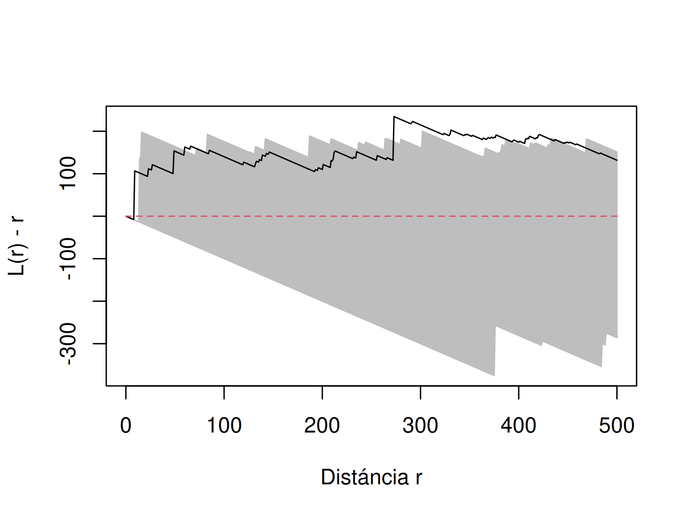

# Caracterización de los siniestros viales ocurridos en Posadas (2022-2023)

Repositorio creado para gestionar los análisis de caracterización de los siniestros viales ocurridos en Posadas.

# Al respecto de los datos
Los datos fueron generados por un proceso de Geocoding o Georreferenciación manual a aparitr de notícias publicadas en el diário Primera Edición, [trabajo desarrollado por Claudia Vargas](https://tusigyt.github.io/lit/proyectos/) como Proyecto de Intervención de la Tecnicatura Universitária en Sistemas de Información Geográfica y Teledetección (TUSIGyT) de la Facultad de Ciencias Forestales (FCF) de la Universidad Nacional de Misiones (UNaM).

Más allá de la ubicación geográfica, el conjunto de datos dispone de una table de atributos con la siguientes informaciones:  
- Fecha de publicación: Fecha de la publicación de la notícia de siniestro vial;
- Lugar: Texto de la ciudad;
- Ubicación: Texto de la ubicación; 
- Vehiculos: Tipo de vehiculo(s) involucrado(s);
- Decesos: Valor numerico de la cantidad de fallecidos reportados en la noticia
- Lesionados: Valor numerico de la cantidad de lesionados reportados en la notícia;
- Incertidumbre: Nível de incertidumbre de la georreferenciación ("Baja", "Media", "Alta");
- Herramienta: Herramienta usada para la georeferenciación ("Geocoding" o "Manual")
- URL de la noticia;

## Otros Datos  

- [IDE Posadas](https://www.ide.posadas.gob.ar/):  
  - [Semaforos](https://www.ide.posadas.gob.ar/layers/ideposadas_data:geonode:Semaforos)  
  - [Red vial](https://www.ide.posadas.gob.ar/layers/ideposadas_data:geonode:red_vial_0305)  
- [IDE Misiones](https://ide.ordenamientoterritorial.misiones.gob.ar/):  
  - Límite Municipal 2023;  

# Objetivos
Realizar un análisis exploratório usando técnicas y estadísticas espaciales/geográficas para caracterizar los siniestro viales reportados y georreferenciados en Posadas;

Algunas preguntas disparadoras y posibles análisis a usar:
- ¿Es posible identificar corelación espacial en los siniestros viales ocurridos en Posadas? ¿A que distáncia se puede identificar dicha correlación espacial?
  - Análisis de segunda orden (Función k-Ripley - [ver](#metodologia) )

- Los siniestros viales seuelen ocurrir cerca a semáforos?
  - Análisis bi-variada de segunda orden (Función k-ripley entre siniestros y [semaforos](https://www.ide.posadas.gob.ar/layers/ideposadas_data:geonode:Semaforos);

# Scripts y análisis
0. [Preparación y preprocesamiento de datos](./scripts/R/0_preparacion_datos.R): Script creado para filtrar y organizar datos para el procesamiento, generando un `.rda` a ser cargado en los scripts subsecuentes;
1. [Análisis de caracterizaciónd e los siniestros viales](./scripts/R/1_analisis_caracterizacioin.R): Realiza la caracterización de primera y segunda orden;

# Metodología
Bivand, Pebesma y Rubio (2011), Câmara y Carvalho (2005), Bailey y Gatrel (1995) y Lloyd (2007) presentan dos categorías diferentes de análisis de Procesos Puntuales, También conocidos como Eventos Discretos.
La primera, conocida como análisis de primer orden, se basa en el análisis de área, considerando la intensidad de los eventos en el área de estudio. Son, también, considerados análisis globales (Câmara y Carvalho, 2005) y corresponden a los análisis de las variaciones del valor medio de los eventos en el espacio, donde se analizan elementos como la intensidad y la densidad de eventos de un proceso determinado en el espacio. Es decir, el número de eventos por unidad de superficie, por lo que se trata de
Se trata de medidas basadas en el análisis del área.

La segunda categoría de análisis se denomina análisis de segundo orden que es considerado como un análisis de escala local, el cual describirá la covarianza (o correlación) entre los valores del proceso en diferentes regiones del área de estudio. En este sentido, se analiza la tendencia a la interacción, la dependencia y la estructura de distribución del proceso estudiado a través de las distancias entre eventos o entre estos y las localidades.
La hipótesis nula, H₀, es una distribución espacial completamente aleatoria (Complete Spatial Randomness — CSR) generada sin dependencia espacial sobre el área R, también definida como un proceso puntual de Poisson (BAILEY y GATREL, 1995; LLOYD, 2007; WALLER y GOTWAY, 2004; PÉSSIER y GOREAUD, 2001). En contraposición a esta distribución, se encuentran las distribuciones regulares (que inhiben la interacción entre sucesos) y las distribuciones aglomeradas, que muestran dependencia espacial e interacción positiva entre sucesos.

Otra aplicación de las funciones de segundo orden es la posibilidad de analizar patrones espaciales multivariable. Este tipo de análisis surge del hecho de que cada proceso o acontecimiento puntual suele ir acompañado de otra información (cuantitativa o cualitativa), además de su espacialización. Un ejemplo sería la identificación de especies, la altitud a la que aparecen, la indicación de presencia o ausencia, etc. Estos procesos puntuales se denominan multivariantes y están formados por eventos marcados, siendo las marcas la información añadida a cada evento (también llamados atributos en los Sistemas de Información Geográfica).
Este análisis surge de preguntas como: «¿Son los atributos de los eventos observados independientes de su localización?» o «¿Tienden ciertos procesos puntuales a producirse de forma agregada?». Es a través del análisis espacial de los procesos puntuales multivariantes como podemos evaluar la correlación entre los atributos y los patrones de distribución observados.